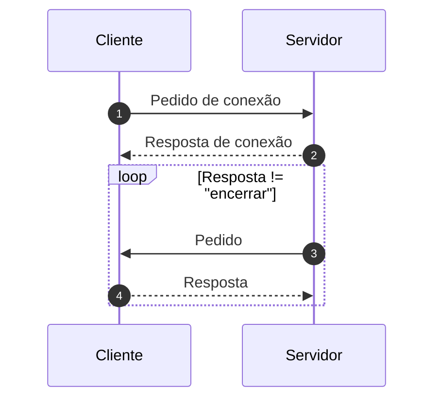
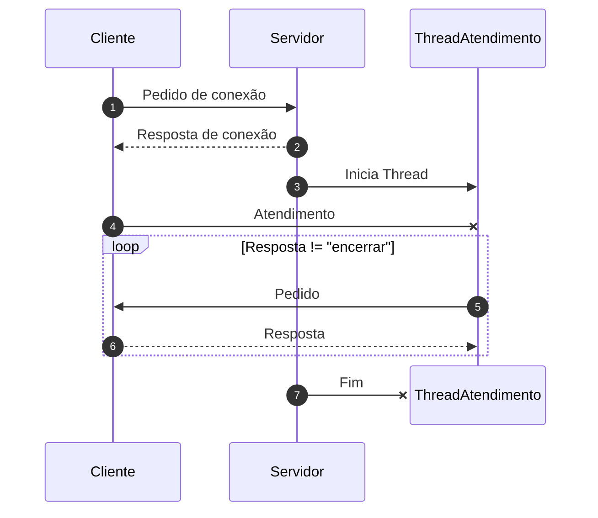

# Diagrama de sequência do protocolo

## Conceito do protocolo

```mermaid
sequenceDiagram
    autonumber
    participant C as Cliente
    participant S as Servidor
    
    C   ->> S: Pedido de conexão
    S  -->> C: Resposta de conexão
    
    loop Resposta != "encerrar"
        S   ->> C: Pedido
        C  -->> S: Resposta 
    end
```

## Implementação do protocolo

```mermaid
sequenceDiagram
    autonumber
    participant C as Cliente
    participant S as Servidor

    C   ->> S: Pedido de conexão
    S  -->> C: Resposta de conexão

    participant ST as ThreadAtendimento    
    S ->> ST: Inicia Thread
    C -x ST: Atendimento
    loop Resposta != "encerrar"
        ST   ->> C: Pedido
        C  -->> ST: Resposta
    end
    destroy ST
    S -x ST: Fim

```